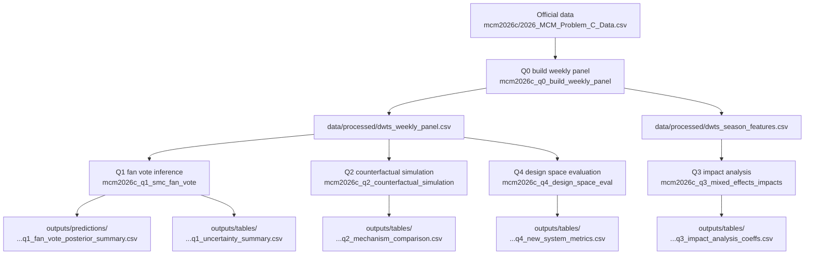
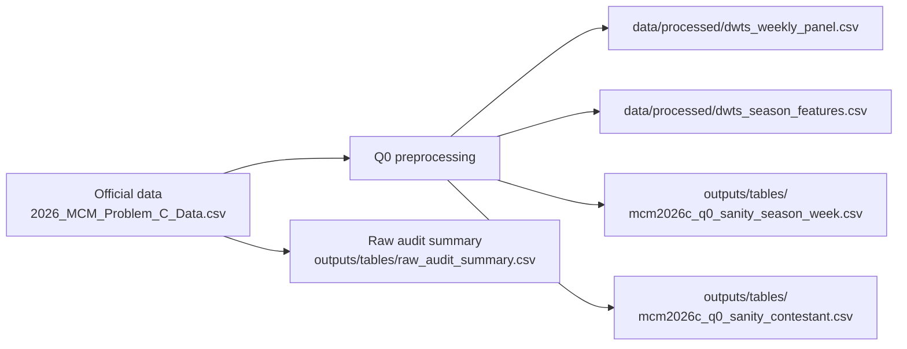

# Q0 Visualization Plan: Data Pipeline & Audit Flowcharts

**Goal**: provide paper-ready, reproducible diagrams for the Q0 data pipeline (wide CSV → canonical processed datasets) and the associated sanity/audit outputs.

## ✅ Mainline scope constraints (must hold for paper-body figures)

- **Mainline figures/diagrams** must be reproducible from:
  - `mcm2026c/2026_MCM_Problem_C_Data.csv`
  - `data/processed/*.csv`
  - `outputs/tables/*.csv`
- `outputs/tables/showcase/*` is **appendix-only** and must not be used as mainline evidence.

---

## Mainline diagrams (paper-ready)

### Fig 0-1: End-to-end pipeline (Q0 → Q4)

**Paper placement**:
- Methods (Data): show what is derived from the official file and what is *not*.
- Reproducibility section: show deterministic artifact paths.

---

### Fig 0-2: Q0 auditing & sanity checks

**What this supports in the paper**:
- “We did not manually edit results.”
- “The weekly panel is internally consistent (e.g., score shares sum to 1).”

---

## Mainline evidence tables (for the paper body)

- `outputs/tables/mcm2026c_q0_sanity_season_week.csv`
- `outputs/tables/mcm2026c_q0_sanity_contestant.csv`
- `outputs/tables/raw_audit_summary.csv`

---

## Narrative / argument mainline (recommended)

- Start with **Fig 0-1** to define “what is produced where”.
- Use **Fig 0-2** to justify that downstream inference (Q1–Q4) is based on audited, canonical datasets.

---

## Appendix / showcase (optional)

No showcase diagrams are required for Q0.
